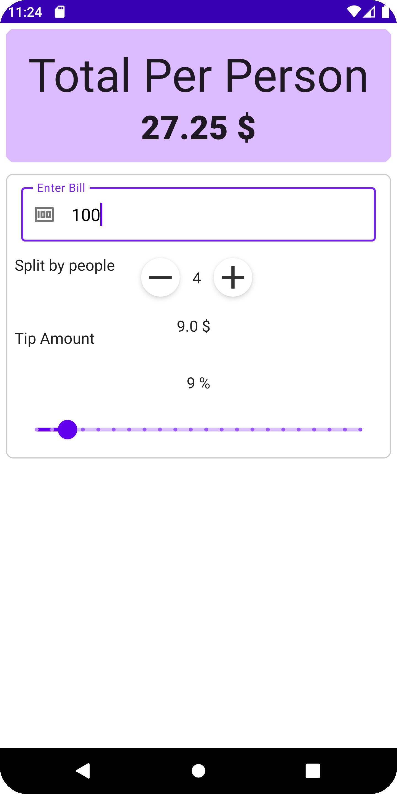

# Android Tip-Calculator

Android tip-calculator app, done with Jetpack Compose.

Project from the course [ Android Jetpack Compose: The Comprehensive Bootcamp](https://www.udemy.com/course/kotling-android-jetpack-compose-/).

  &nbsp;&nbsp;
  &nbsp;&nbsp;
  &nbsp;&nbsp;
  

